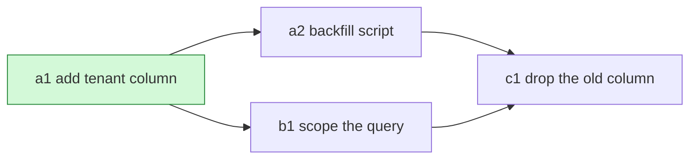

# The DAG and the plan file

The reference for phases 4 and 5 of [`ticket`](SKILL.md), and for amending the plan
mid-run. Skipped at the small tier, which plans in chat instead.

## Nodes

A **node** is one unit of work that ends in a state a command can check. Fields:

| Field | Meaning |
| --- | --- |
| `id` | short slug, used as the mermaid label and the commit scope |
| `goal` | one sentence naming the observable change |
| `files` | the paths it touches |
| `mirrors` | the existing file this code should end up looking like |
| `seam` | where the test goes, per `tdd` |
| `check` | the exact command that proves this node green |
| `effort` | cheap, medium, or expensive |
| `risk` | plain or risky; risky nodes get a `/blast-radius` pass |
| `deps` | the ids that must land first |

Sizing: a node small enough that its `check` is one command, and big enough that
its `goal` is a sentence rather than an edit. When you cannot name a `check`, the
node is not a node yet, so split or merge it until you can.

## Edges

An edge means a true dependency: node B cannot be written or cannot pass its
`check` until node A lands. Nothing else is an edge. Ordering you merely find tidy
is a false edge, and every false edge costs parallelism.

Keep the graph acyclic. A cycle means two nodes are one node.

## The plan file

Lives at `plans/<TICKET-ID>.md` in the repo, so subagents and a later session can
find it. Keep it out of git without touching the repo's tracked config by adding
`plans/` to `.git/info/exclude`.

```md
# <TICKET-ID> <title>

## Ticket
Link, and the acceptance criteria verbatim.

## Tier
Which tier, and the signal that decided it.

## Findings
Recon conclusions: pattern target, conventions, external facts with citations.

## DAG
The mermaid render.

## Nodes
One heading per node with its fields, then its decisions from phase 5.

## Amendments
Append-only. Date, node, what changed, whether it was re-gated.

## Open questions
```

Write what the code will not later explain. Decisions and the options rejected,
gotchas, open questions, the next step. Leave out restated docstrings, a changelog
of finished work, and explanations of commands.

## Mermaid render

A flowchart, node `id` as the first token of each label, effort in a side table
rather than in the graph. Mark landed nodes as they pass `verify`.



| id | effort | risk |
| --- | --- | --- |
| a1 | cheap | plain |
| a2 | medium | risky |

## Amendments

Implementation will prove some part of the plan wrong. Route the change by what it
touches:

- **Topology changed**, meaning a node was added or removed or an edge moved, or a
  decision the user already reviewed was reversed: amend the file, then re-gate.
- **Anything smaller**: append to Amendments and keep going.

Supersede decisions in the Amendments log rather than editing them in place, so the
trail of what was believed when stays readable.
